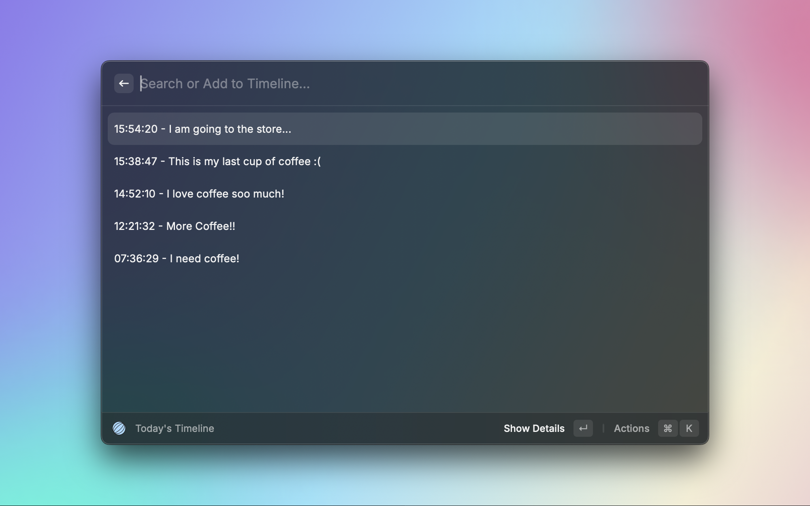
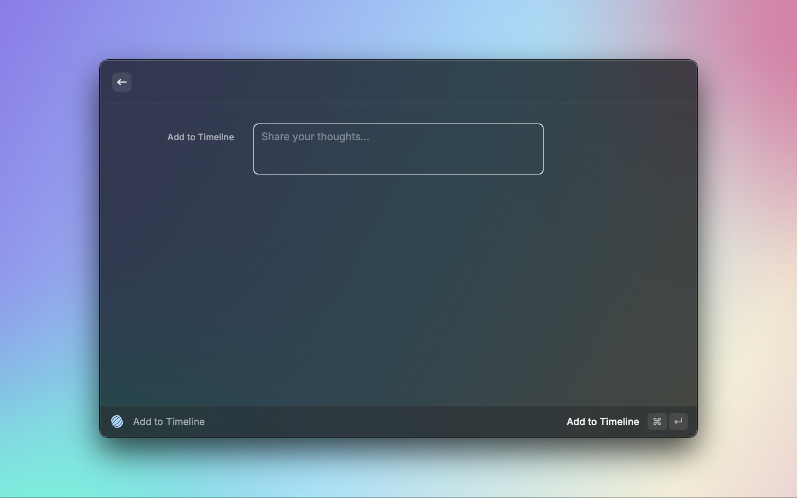
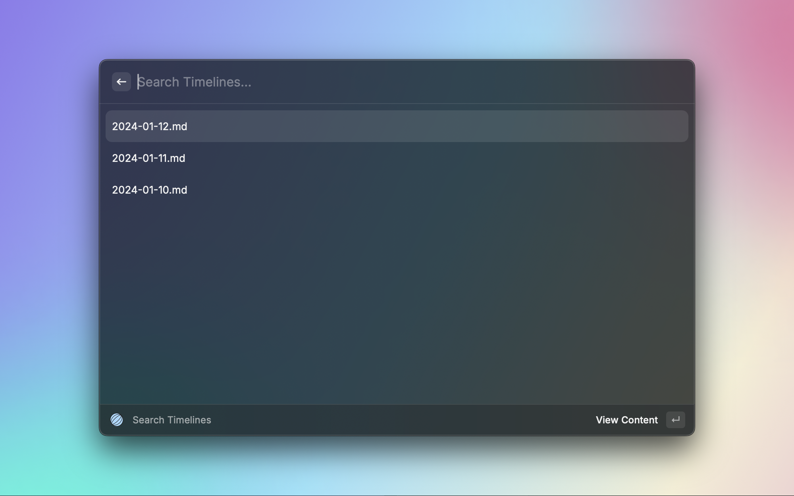

# Raycast Timeline Journal

Put your thoughts on a timeline.

### Today's Timeline

### Add to Timeline (Longform)

### Search Your Previous Timelines

## Setup
Provide a folder path to store all your timelines in markdown format. Then start journaling!

Adjust additional settings such as insert position, date, and time format, go to: `Raycast Settings > Extensions > Timeline Journal`.

## Other Notes
Timeline Journal has been merged with [SnapJot](https://www.raycast.com/k41531/snap-jot)! 

Please visit the Raycast Store and download the SnapJot extension.

Otherwise, you can download this version by cloning this repo and running `npm install && npm run dev`.
